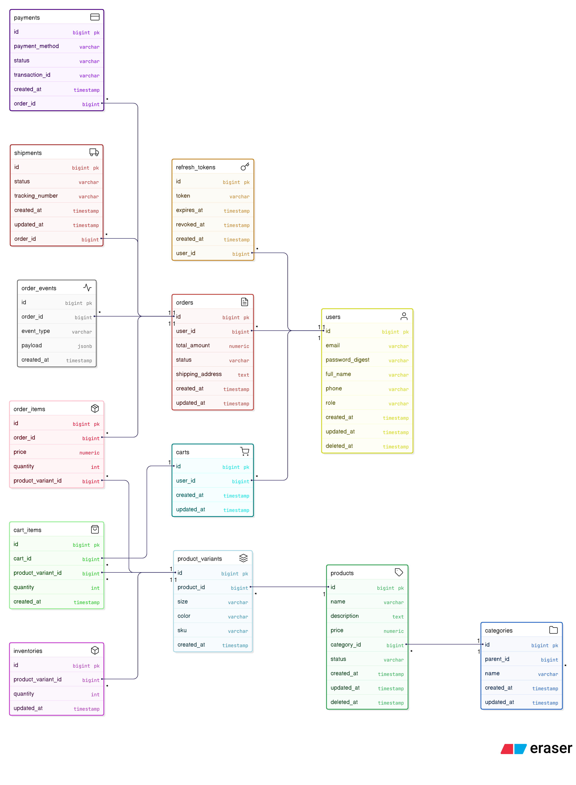

# Nike Clothing Store – E-Commerce Platform

## 1. Purpose
Build an e-commerce platform for retailing Nike products such as Shoes, Jackets, and T-Shirts, allowing users to browse products, make purchases, process payments, and track orders. The system is designed to be scalable, maintainable, and API-first, supporting both web and mobile in the future.

## 2. Business Objectives
- Provide a smooth online shopping experience
- Support user and order growth
- Easily expand to:
	- Mobile app
	- Promotional programs
	- Loyalty / Membership

## 3. Project Scope
- User Authentication & Authorization
- Product Catalog (Shoes, Jackets, T-Shirts)
- Shopping Cart
- Checkout & Payment (mock)
- Order Management
- Shipping tracking (basic)
- Admin Dashboard

## 4. Out of Scope
- Integration with real payment gateways
- Advanced loyalty program
- Third-party shipping provider integration
- Mobile app development in initial phase

## 5. Non-functional Requirements (NFR)
- System must handle at least 10,000 concurrent users
- Response time < 3 seconds for product browsing
- Secure user data with encryption (AES-256)
- System uptime 99.9%
- Scalable architecture for future growth

## 6. User Types & Roles
- **Guest:** Browse products, search & filter, add to cart (must register to checkout)
- **Customer:** Register/Login, manage profile, view order history, track shipping, save cart
- **Admin:** Manage products & categories, inventory, orders, view sales statistics

## 7. Core Business Flow
Browse Products → Add to Cart → Checkout → Payment → Order Creation → Shipping

## 8. Business Rules
- Do not allow checkout if product is out of stock or price changes
- Guest must register before checkout; merge temporary cart
- An order can only have one payment status
- Inventory must be locked during checkout
- Order cannot be edited after successful payment

## 9. ERD
(See below for diagram)

## 10. Timeline & Milestones (8 Weeks)
- **Week 1:** Requirement Gathering & Analysis, Draft BRD, High-level Architecture Diagram
- **Week 2:** Finalize BRD & Approval, Detailed System Design, Database Schema Design
- **Week 3:** Implement User Authentication & Authorization, Product Catalog (basic CRUD)
- **Week 4:** Shopping Cart, Inventory Check, Begin API documentation
- **Week 5:** Checkout Flow, Mock Payment Integration
- **Week 6:** Order Management, Shipping Tracking (basic), Admin Dashboard (basic)
- **Week 7:** Integration Testing, Bug Fixing, Prepare Deployment Plan
- **Week 8:** Final QA, Deployment, Complete Documentation (BRD, Architecture, API)

---


## Getting Started

### Prerequisites
- Ruby (>= 3.0)
- Rails (>= 7.0)
- PostgreSQL (hoặc MySQL, tùy cấu hình database)
- Node.js & Yarn (cho asset pipeline nếu dùng)

### Cài đặt & Khởi động dự án
```bash
# Clone repository
git clone <repo-url>
cd E_Commerce_BackEnd

# Cài đặt gem
bundle install

# Cài đặt JavaScript packages (nếu có)
yarn install # hoặc npm install

# Tạo database & migrate
rails db:create db:migrate db:seed

# Chạy server
rails server
```

### Các lệnh hữu ích
- Chạy test: `rails test`
- Rubocop: `bundle exec rubocop`
- Brakeman: `bundle exec brakeman`

### Đường dẫn truy cập
- Trang chủ: http://localhost:3000
- API docs: (nếu có, bổ sung đường dẫn)

---

## ERD


---

## License
MIT
