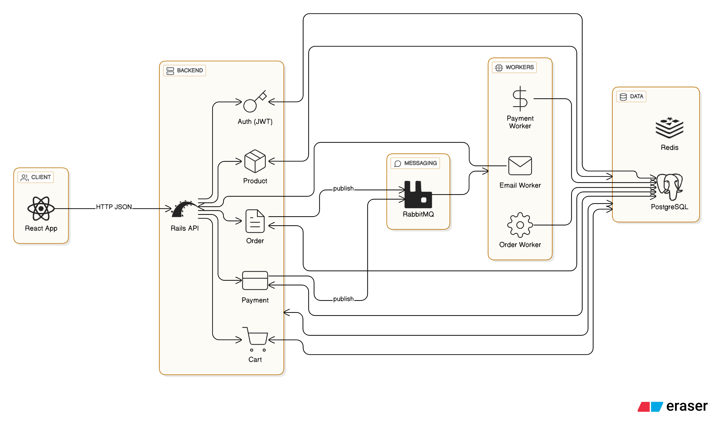

# High-Level Architecture

## 1. Overview

This document describes the **high-level architecture** of the Nike Clothing Store E-Commerce Platform.
The system is designed as an **API-first, distributed architecture** that cleanly separates frontend, backend, and infrastructure concerns.  
This approach ensures scalability, maintainability, and the ability to support multiple clients (Web, Mobile) in the future.

---

## 2. Architectural Goals

- Clear separation between frontend and backend
- Scalable under increasing user and order volume
- Easy integration with third-party services
- Support synchronous and asynchronous workflows
- Prepared for future mobile applications

---

## 3. System Components

### 3.1 Client Layer (Frontend)

- Web application built with React
- Responsible for:
  - UI rendering
  - User interactions
  - Calling backend APIs
- Stateless with respect to business logic

Clients communicate with the backend exclusively through **REST APIs**.

---

### 3.2 API Layer (Backend – Ruby on Rails)

- Rails API-only application
- Core responsibilities:
  - Authentication & authorization (JWT)
  - Business logic (cart, orders, payments)
  - Data validation
  - Exposing RESTful endpoints

The backend acts as the **single source of truth** for the system.

---

### 3.3 Data Layer

- **PostgreSQL**
  - Stores core business data (users, products, orders, payments)
  - Ensures data consistency and transactional integrity

- **Redis**
  - Caching frequently accessed data (products, categories)
  - Session and temporary data storage (cart, tokens)
  - Improves response time and reduces database load

---

### 3.4 Message Queue (RabbitMQ)

RabbitMQ is used to handle **asynchronous workflows** to avoid blocking user requests.

Typical async events:
- `order_created`
- `payment_success`
- `send_email`
- `inventory_update`

Benefits:
- Faster API response times
- Better fault isolation
- Easier retry and monitoring
- Improved scalability

---

### 3.5 External Services

- Payment gateways
- Email / notification services
- Shipping providers (future)

These services are integrated via background consumers rather than synchronous API calls when possible.

---

## 4. Synchronous vs Asynchronous Flow

### Synchronous (HTTP Request)
Used for:
- Authentication
- Cart operations
- Order creation (initial step)

Goal:
- Immediate feedback to the user

---

### Asynchronous (Message Queue)
Used for:
- Payment confirmation
- Email notifications
- Inventory updates

Goal:
- Avoid long-running requests
- Improve system resilience

---

## 5. High-Level Request Flow

