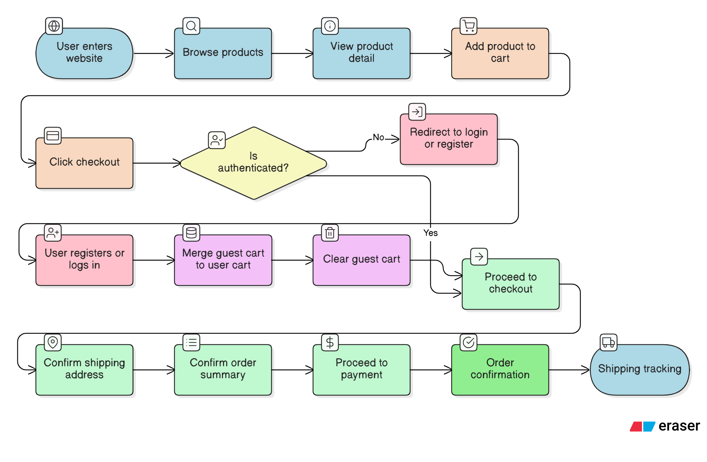

# Pages & User Flow

## 1. User Flow Diagram

### 🎯 Objectives
- Describe user behavior from entering the website to completing a purchase
- Clearly distinguish **Guest** vs **Authenticated User**
- Serve as the foundation for:
  - Authentication logic
  - Guest cart handling
  - Cart merge after login
  - API access protection

---

### 🧭 Flow Explanation

1. User enters the website and browses products
2. User views product details
3. User adds product to cart
4. User clicks **Checkout**
5. System checks authentication status:
   - ❌ Not authenticated → Redirect to login / register
   - ✅ Authenticated → Proceed to checkout
6. If user logs in:
   - Guest cart is merged into user cart
   - Guest cart is cleared
7. User confirms:
   - Shipping address
   - Order summary
8. User proceeds to payment
9. Order confirmation & shipping tracking

---

### 🧠 Design Notes
- Guest cart is stored in session or Redis
- Cart merge logic runs **once after successful login**
- Checkout APIs are protected by authentication middleware
